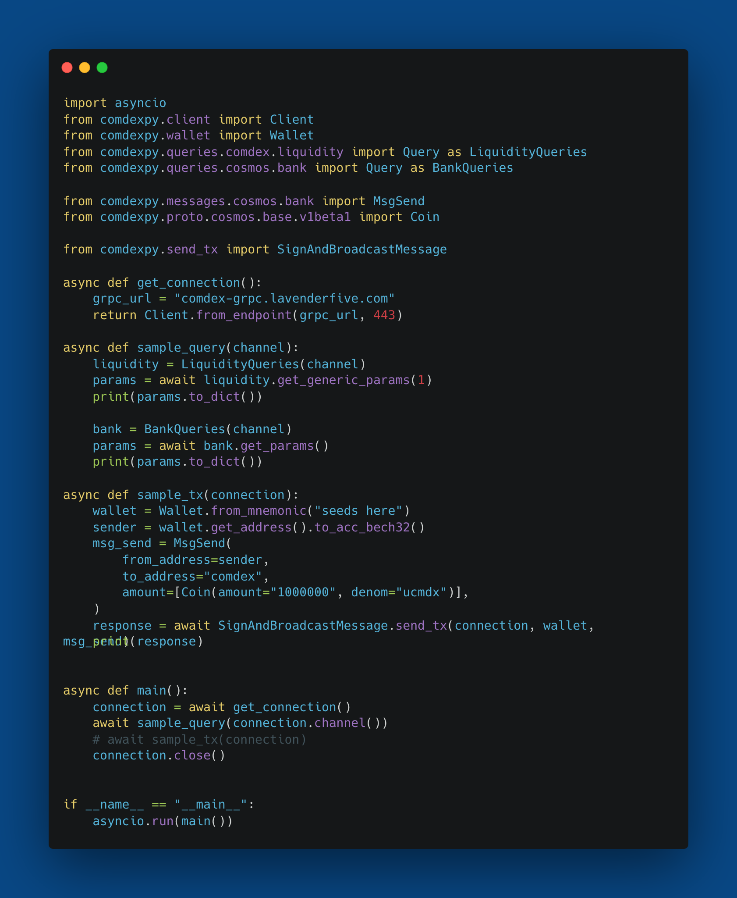

# comdexpy


The comdexpy is a comprehensive Python library designed to provide developers with easy access to the Comdex blockchain and its ecosystem. 
This library enables developers to interact with the blockchain, query data, and perform various operations within the Comdex ecosystem.


## Installation


```bash
  pip3 install comdexpy
```
    

## Usage



## Documentation

You can read the documentation [here.](https://linktodocumentation)


## Feedback

If you have any feedback, please reach out to us at https://forum.comdex.one/


## License

This software is licensed under the GPL-3.0 license. See [LICENSE](comdexpy/docs/license) for full disclosure.


[](https://opensource.org/licenses/)


